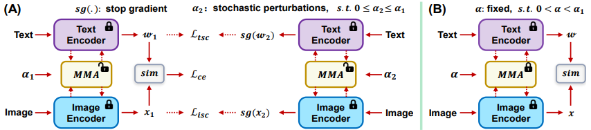

## [**MMA++: Effective Multi-Modal Adaptation for Vision-Language Models (T-PAMI2026)**](https://ieeexplore.ieee.org/document/11534926)<br>
[Lingxiao Yang](https://zjjconan.github.io/), [Ru-Yuan Zhang](https://ruyuanzhang.github.io/), [Yanchen Wang](https://ppwangyc.github.io/), [Xiaohua Xie](https://cse.sysu.edu.cn/teacher/XieXiaohua)<br>
Sun Yat-sen University, Peking University, Columbia University<br>

This paper builds upon our CVPR 2024 publication, MMA: Multi-modal Adapter for Vision-Language Models, by providing a new theoretical analysis and proposing a theory-driven adaptation framework.


## Highlights



> **<p align="justify"> Abstract:** Large scale pre-trained Vision-Language Models (VLMs) have shown good generalization capabilities across diverse downstream tasks. However, adapting such large-scale models to few-shot generalization scenarios remains challenging due to the trade-off between preserving general knowledge and incorporating task-specific information. In this paper, we propose MMA++, an advanced and effective Multi-Modal Adapter framework for parameter-efficient VLM adaptation. Unlike prior works that independently inject adapters into each modality or uniformly across layers, MMA++ performs a dataset-level analysis to identify discriminative and generalizable features, and selectively applies adapters to the higher layers of both vision and text encoders. To bridge the modality gap, we further propose a shared feature projection space that enhances alignment between modalities. Beyond architecture design, we identify the fusion scale $\alpha$—which controls the strength of adapter integration—as a key factor in few-shot generalization. We empirically and theoretically demonstrate that $\alpha$ should not be static, but adapted based on training data size. To reduce the effort of tuning this value across different datasets, we propose the $\alpha$-consistency framework, consisting of: (1) a consistency training strategy under varying fusion scales; and (2) an $\alpha$-decoupling strategy that uses a larger fusion scale during training and a smaller one at inference to account for sample size mismatch. We evaluate MMA++ on a wide range of fewshot generalization tasks, including base-to-novel generalization, cross-dataset transfer, and domain generalization. Our method consistently achieves leading performance. </p>

## Contributions

- We introduce a dataset-level analysis method to systematically examine feature representations in transformerbased CLIP models, providing insights for designing
more effective and efficient adapters for VLMs. <p></p>
- We propose a novel adapter architecture with modalityspecific projection layers that enhance feature representations in both image and text encoders, along with a shared
projection layer to improve cross-modal alignment. <p></p>
- We reveal, through empirical studies and theoretical analysis, the critical role of the fusion scale $\alpha$ in few-shot generalization, which motivates the development of our $\alpha$-consistency framework. <p></p>
- We design a training strategy within this framework that enforces consistent model behavior across varying fusion scales by leveraging stochastic scale perturbations and αaware consistency losses. <p></p>
- We further propose an α-decoupling strategy that reduces the fusion scale at test time, addressing the discrepancy between training and testing conditions and enhancing generalization reliability. <p></p>
- We integrate MMA and MMA++ into the CLIP model and evaluate them on multiple few-shot generalization tasks, where our methods achieve leading performance.


## All Results over Three Benchmarks
Results reported below are average accuracy across 3 evaluated test settings. Please refer to our paper for more details.

| Method | Base2New (HM) | Cross-Datasets | Domain Generalization | Avg |
| -----: | :-----------: | :------------: | :-------------------: | :-: |
| [CLIP](https://arxiv.org/abs/2103.00020)      | 71.70 | 65.15 | 57.18 | 64.67
| [CoOp](https://arxiv.org/abs/2109.01134)      | 71.66 | 63.88 | 59.28 | 64.94
| [CoCoOp](https://arxiv.org/abs/2203.05557)    | 75.83 | 65.74 | 59.91 | 67.16
| [MaPLe](https://arxiv.org/abs/2210.03117)     | 78.55 | 66.30 | 60.27 | 68.37
| [PromptSRC](https://arxiv.org/pdf/2307.06948) | 79.97 | 65.81 | 60.65 | 68.81
| **MMA (CVPR2024)**                            | 79.87 | 66.61 | 60.48 | 68.99
| **MMA++ (This work)**                         | 82.07 | 69.66 | 61.30 | **71.01**
------------------------------------------------------------
<p></p>

## Installation 
This code is built on top of the awesome project - [CoOp](https://github.com/KaiyangZhou/CoOp), so you need to follow its setup steps:

First, you need to install the `dassl` environment - [Dassl.pytorch](https://github.com/KaiyangZhou/Dassl.pytorch). Simply follow the instructions described [here](https://github.com/KaiyangZhou/Dassl.pytorch#installation) to install `dassl` as well as PyTorch. After that, run `pip install -r requirements.txt` under `VLM-MMApp/` to install a few more packages required by [CLIP](https://github.com/openai/CLIP) (this should be done when `dassl` is activated).

Second, you need to follow [DATASETS.md](docs/DATASETS.md) to install the datasets.


## How to Run
```bash
# arg1 = used gpu_id
# arg2 = seed number
# using the following command for the base2new experiment
bash run_b2n.sh 0 1

# using the following command for the cross-datasets and domain-generalization experimetns
bash run_xd.sh 0 1
```

------------------------------------------------------------

## Citation
If you find our work or this repo helpful for your research, please kindly cite the following papers:

```bash
@ARTICLE{YangMMA++_TPAMI2026,
  author={Yang, Lingxiao and Zhang, Ru-Yuan and Wang, Yanchen and Xie, Xiaohua},
  journal={IEEE Transactions on Pattern Analysis and Machine Intelligence}, 
  title={MMA++: Effective Multi-Modal Adaptation for Vision-Language Models}, 
  year={2026},
  doi={10.1109/TPAMI.2026.3691448}
}

@InProceedings{YangMMA_CVPR2024,
    author={Yang, Lingxiao and Zhang, Ru-Yuan and Wang, Yanchen and Xie, Xiaohua},
    title={MMA: Multi-Modal Adapter for Vision-Language Models},
    booktitle={Proceedings of the IEEE/CVF Conference on Computer Vision and Pattern Recognition (CVPR)},
    month={June},
    year={2024},
    pages={23826-23837}
}
```

## Acknowledgements
Our code is based on [Co-CoOp](https://github.com/KaiyangZhou/CoOp), [CoOp](https://github.com/KaiyangZhou/CoOp) and [MMA](https://github.com/ZjjConan/VLM-MMA) repositories. We thank the authors for releasing their codes.
